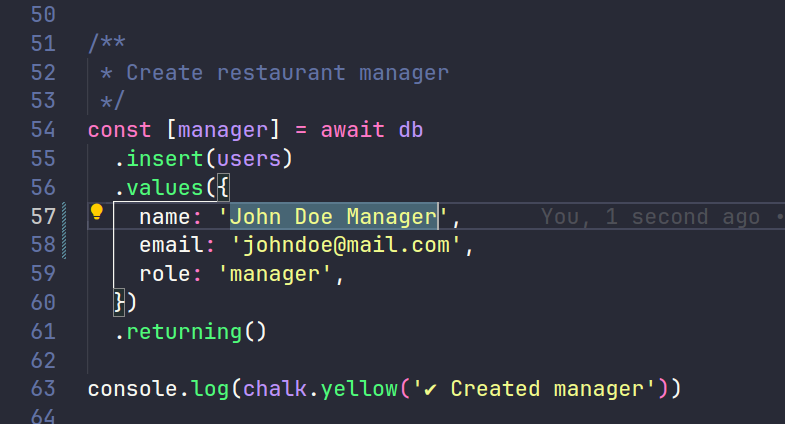
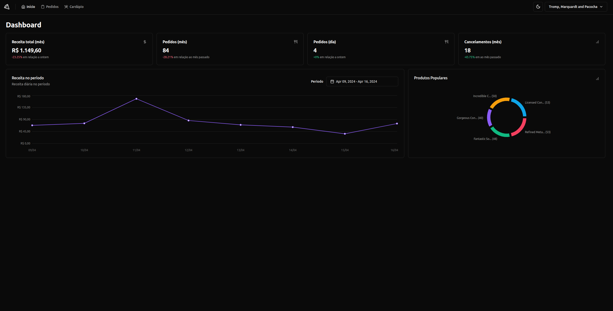

## What is Pizza Shop

Is an application that able all the 
entrepreneur levels to create your own business and make money, with a friendly interface and useful features to make your business grow.

## How to run
**obs:** you will need first to install NodeJS and Docker

1- Clone the [backend repository](https://github.com/CaioCesarPS/pizzashop-backend)

2- Inside backend folder in ```src/db/seed.ts```, if you want to create your mocked restaurant with orders and fake data you need to change the lines 57 and 58, the email you can use a fake email or your real email.


3- execute inside the backend folder ```docker compose up -d --build && npm i && npm run migrate && npm run seed && npm run dev```, this commands will build the database, download required libs, create the tables, populate the tables with fake data and execute the project.

4- Execute inside the frontend folder ```npm i && npm run dev```.

5- Now the email that you used in the seed, to login.

6- You will receive a magic link into the backend that you are running, after that you will be redirect to home page.


## Implemented

- [x] Home page with graphics and card with key details of restaurant.
- [x] Orders page with button that change status of order and cancel button.
- [x] Order details modal when clicking into magnifying.
- [x] Restaurant Modal, able to change name and description of establishment.
- [x] Filters to filter order by Id and name of client.
- [x] Dark theme.

## To implement

- [ ] Products page, to be able to register new products into restaurant.
- [ ] Client page to be able the clients to order things into establishment.
- [ ] Deliver page.
- [ ] Refactor the Orders page. (infinity scroll or tabs with diferent status)
